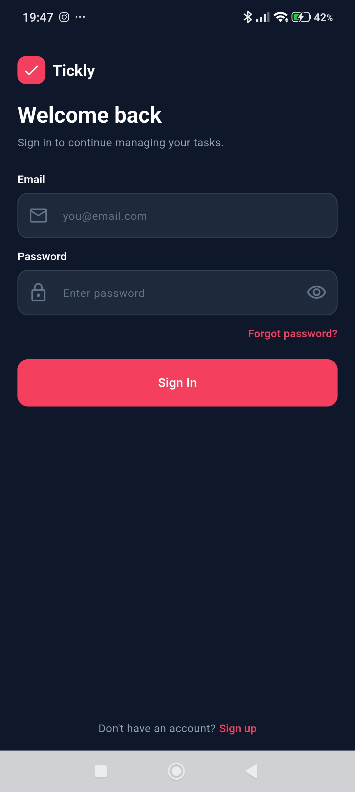
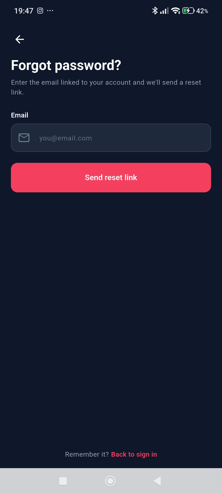
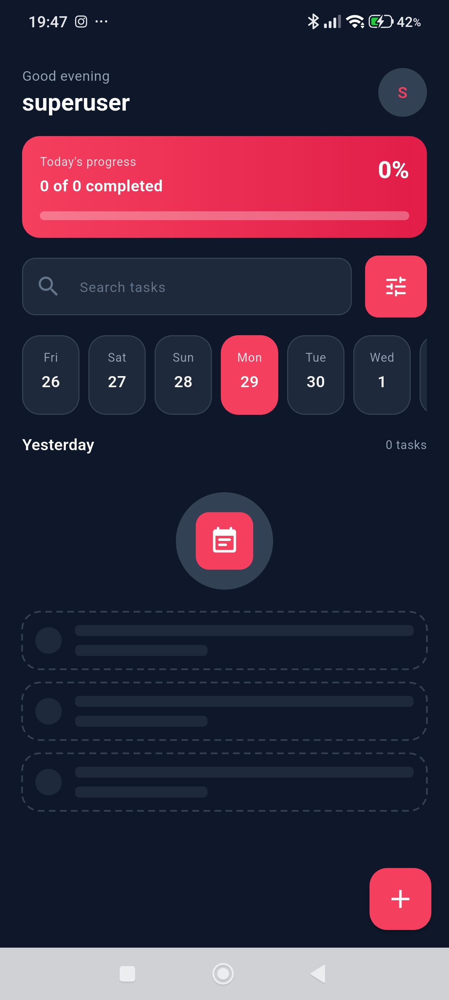
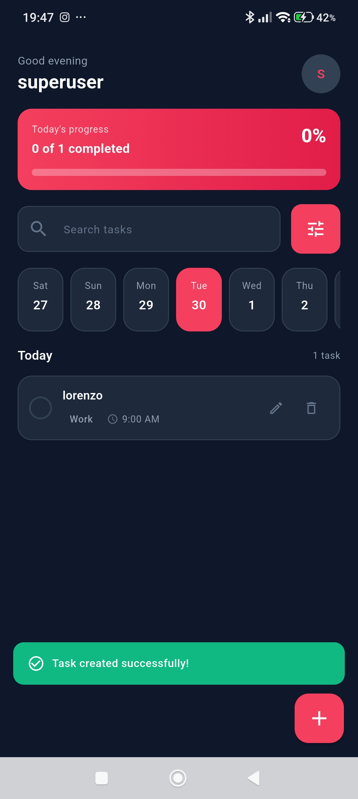
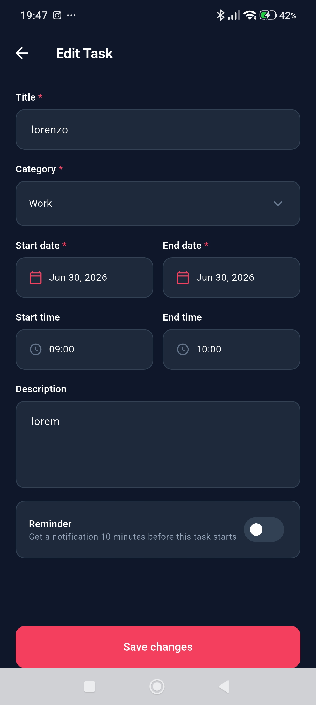
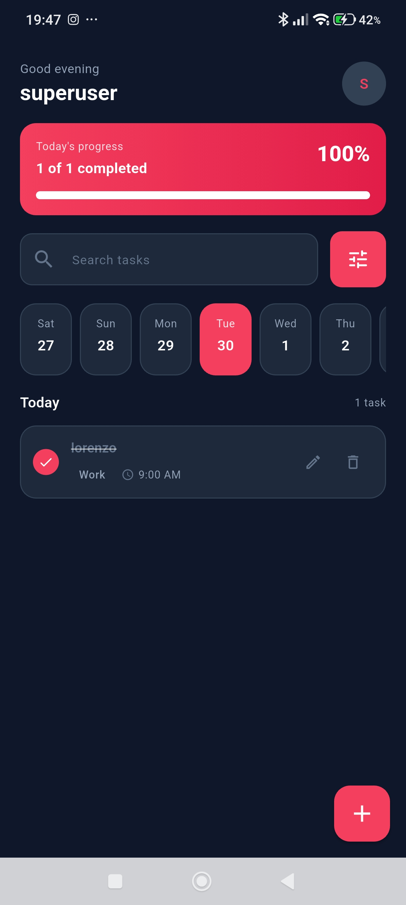
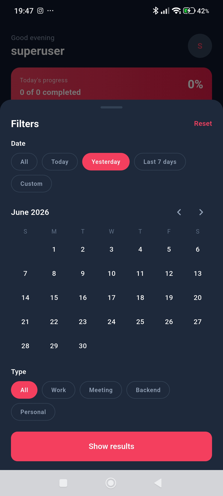

# Tickly

A simple, good-looking task / to-do app built with **Flutter**, backed by a
**Bun + Elysia** API. Supports **light and dark mode**. The Flutter client talks
to the backend for real authentication and task storage.

Built for the **UAS — Mata Kuliah Mobile Computing** (continuation of the UTS
project). It applies an MVC architecture, Provider state management, REST API
integration, secure local storage, and a device feature (**local
notifications**). See [Requirement coverage (UAS)](#requirement-coverage-uas)
for how each grading criterion is met.

## Design Figma
> [Figma](https://www.figma.com/design/0RHKf9rnC2E3UewGewrmRY/Cakyu---Tickly?node-id=0-1&t=HXl42D19lVIKX9AO-1)

## Features

- **Authentication** — Sign in, Create account, Forgot password, Reset password,
  backed by JWT auth (token stored in the platform's encrypted keystore).
- **Home / task list** — greeting + daily progress card (`X of Y completed`,
  %), search, a centered week date strip, and today's tasks with category tags
  and times. Pull to refresh.
- **Create / Edit task** — title, category, start/end date, start/end time,
  description, and a **reminder** toggle, with inline validation.
- **Local notifications (device feature)** — turning on a task's reminder
  schedules an **on-device notification that fires 10 minutes before** the task
  starts (via `flutter_local_notifications`). The schedule stays in sync as
  tasks are created, edited, completed, or deleted, and is cleared on sign-out.
- **Filters** — bottom sheet to filter by category and date range
  (Today / Yesterday / Last 7 days / Custom date via a calendar).
- **Light & dark theme** that follows the system setting.

> The design lives in `docs/design.jpg` and is the source of truth for screens
> and behavior.

## Architecture

The app follows an **MVC** layering with **Provider** (`ChangeNotifier`) for
state:

- **Model** — `models/` (data + JSON mapping) and `data/` (repositories that
  call the API).
- **View** — `features/` screens + `widgets/`, which observe controllers.
- **Controller** — `controllers/` (`AuthController`, `TaskController`) hold state
  and orchestrate the repositories.

The backend (`./backend/`) is a clean-architecture **Elysia** service on **Bun**
with **PostgreSQL** (Drizzle ORM), **Redis**, **BullMQ** (email reminders), and
**JWT/RBAC**.

## Requirement coverage (UAS)

How the project meets each requirement and grading criterion for the
**Mobile Computing** final exam:

| # | Requirement | How it's implemented | Where |
| - | ----------- | -------------------- | ----- |
| 1 | **UI/UX design** (consistent, from UTS, public Figma) | Token-driven theme (`AppColors`) with light/dark mode, consistent components, hierarchy from the Figma design | [Figma](https://www.figma.com/design/0RHKf9rnC2E3UewGewrmRY/Cakyu---Tickly?node-id=0-1&t=HXl42D19lVIKX9AO-1), `docs/design.jpg`, `lib/theme/`, `lib/widgets/` |
| 2 | **Software architecture** (min. MVC, clear separation) | MVC: Model (`models/` + `data/` repositories), View (`features/` + `widgets/`), Controller (`controllers/`) | `lib/models`, `lib/data`, `lib/controllers`, `lib/features` |
| 3 | **State management** (min. Provider) | `ChangeNotifier` controllers exposed via `provider`; views observe and rebuild | `lib/controllers/`, `lib/main.dart` (`MultiProvider`) |
| 4 | **REST API integration** (≥1 feature, list data) | Home **task list** is fetched from the backend `GET /tasks`; full CRUD against the API | `lib/data/task_repository.dart`, `lib/core/network/api_client.dart` |
| 5 | **Local storage** (Secure Storage / SharedPreferences) | **Secure Storage** persists the JWT access token / login status across launches | `lib/core/storage/token_storage.dart` (`flutter_secure_storage`) |
| 6 | **Mobile feature** (Camera **or** Local Notification) | **Local Notification** — schedules a reminder 10 min before a task starts; kept in sync with the task lifecycle | `lib/core/notifications/`, `lib/controllers/task_controller.dart` |
| 7 | **README documentation** (description, features, public Figma) | This README + the Figma link above | `README.md` |
| 8 | **Login page & Home page** (minimum screens) | Sign-in screen and Home/task-list screen | `lib/features/auth/sign_in_screen.dart`, `lib/features/tasks/home_screen.dart` |

> **Mobile feature note:** the assignment asks for **camera _or_ local
> notification** — this project implements **local notifications**. Camera was
> intentionally not added (no design and no fit in a to-do app).

## Screenshots

Captured on a physical Android device (dark mode).

| Sign in | Forgot password | Home (empty) |
| :-----: | :-------------: | :----------: |
|  |  |  |

| Home (task created) | Edit task — reminder | Home (completed) |
| :-----------------: | :------------------: | :--------------: |
|  |  |  |

| Filters |
| :-----: |
|  |

> The **Edit task** shot shows the **Reminder** toggle that schedules the
> on-device local notification 10 minutes before the task starts.

## Requirements

- [Flutter SDK](https://docs.flutter.dev/get-started/install) (Dart `^3.12.1`)
- A device or emulator (Android / iOS), or Chrome / desktop for web/desktop.
- For the backend: [Bun](https://bun.sh) and [Docker](https://docs.docker.com/)
  (for PostgreSQL + Redis).

Verify your Flutter setup with `flutter doctor`.

## Running the backend

The backend lives in [`./backend`](./backend) and must be running for sign-in
and tasks to work. See [`backend/README.md`](./backend/README.md) for full
details; the short version:

```bash
cd backend

# 1. Environment (.env is gitignored; copy the example and adjust if needed)
cp .env.example .env

# 2. Start PostgreSQL + Redis
docker compose up -d postgres redis

# 3. Install deps, run migrations, seed demo data
bun install
bun run db:migrate
bun run db:seed

# 4. Start the API (hot reload) on http://localhost:3000
bun run dev
```

API docs (Swagger UI) are served at <http://localhost:3000/docs>.

**Notes**

- The Postgres **host port is `5433`** (5432 is commonly already in use). It's
  set via `POSTGRES_PORT` / `DATABASE_URL` in `backend/.env`.
- Seeding creates a pre-verified account you can sign in with immediately:
  **`superuser@example.com`** / **`password`** (also `admin@example.com`).
- New accounts created via **Create account** require email verification before
  they can sign in. Configure SMTP in `backend/.env` (e.g. a local
  [Mailpit](https://github.com/axllent/mailpit) on `:1025`) to receive the
  verification/reset emails in development.

## Running the Flutter app

```bash
# 1. Install dependencies
flutter pub get

# 2. Run, pointing at your backend (see ".env / API base URL" below)
flutter run --dart-define-from-file=.env
```

Pick a specific target:

```bash
flutter devices                                    # list devices
flutter run -d chrome   --dart-define-from-file=.env
flutter run -d windows  --dart-define-from-file=.env
```

### .env / API base URL

The app reads its backend URL from `API_BASE_URL`. Configuration lives in a
`.env` file (gitignored) that you pass at build/run time with Flutter's
`--dart-define-from-file` flag — there's no extra package involved.

```bash
# Create your local .env from the template
cp .env.example .env
# edit API_BASE_URL for your setup, then run:
flutter run --dart-define-from-file=.env
```

Pick the right host for where the app runs:

| Target                  | `API_BASE_URL`                  |
| ----------------------- | ------------------------------- |
| Android emulator        | `http://10.0.2.2:3000`          |
| iOS simulator / desktop | `http://localhost:3000`         |
| Web (Chrome)            | `http://localhost:3000`         |
| Physical device         | `http://<your-LAN-IP>:3000`     |

If you run **without** the flag, `AppConfig` falls back to a per-platform
default (`10.0.2.2` on Android, otherwise `localhost`). Tip: add
`--dart-define-from-file=.env` to your IDE run configuration (VS Code
`launch.json` → `"args"`) so you don't type it each time.

#### Running on a physical phone

`10.0.2.2` and `localhost` do **not** work from a real device — they only mean
something inside an emulator/simulator or on the host itself. To run on a
physical phone:

1. Put the phone and the PC on the **same Wi-Fi network**.
2. Find your PC's LAN IP (`ipconfig` on Windows → IPv4 Address, e.g.
   `192.168.0.101`) and set it in `.env`:
   ```
   API_BASE_URL=http://192.168.0.101:3000
   ```
   This is a DHCP address — if it changes after a reconnect, update `.env`.
3. Allow inbound port 3000 through the PC firewall once (elevated PowerShell on
   Windows):
   ```powershell
   New-NetFirewallRule -DisplayName "Tickly backend 3000" -Direction Inbound -LocalPort 3000 -Protocol TCP -Action Allow
   ```
4. **Cleartext HTTP**: Android 9+ blocks plaintext `http://` by default. Debug
   builds already allow it (`android:usesCleartextTraffic="true"` in
   `android/app/src/debug/AndroidManifest.xml`); for a release build you'd serve
   the API over HTTPS or add a network-security config.
5. Sanity check: open `http://<PC-LAN-IP>:3000/health` in the **phone's**
   browser — a JSON `"healthy"` response means the app will connect.
6. Fully stop and relaunch (a hot reload won't pick up `.env` or manifest
   changes): `flutter run --dart-define-from-file=.env`.

> The API client times out after 15s, so a wrong/unreachable URL surfaces a
> "could not reach the server" error instead of spinning forever.

## Using the app

1. Start the backend (above), then launch the app.
2. **Sign in** with the seeded account `superuser@example.com` / `password`, or
   tap **Sign up** to register (then verify the email and sign in).
3. On **Home**, you'll see today's progress and tasks. Tap a task's checkbox to
   mark it done — the progress bar updates live. Pull down to refresh.
4. Use the **week strip** to switch days; the selected day stays centered.
5. Tap the **search** field to filter tasks by title. Tap anywhere outside an
   input to dismiss the keyboard.
6. Tap the **filter button** (next to search) to filter by category / date
   range, then **Show results**. **Reset** clears the filters.
7. Tap the **+ button** to create a task; use the **edit** / **delete** icons on
   a task row to modify or remove it.
8. Tap your **avatar** (top-right) to log out.

## Common commands

```bash
flutter pub get                                  # install deps
flutter run --dart-define-from-file=.env         # run against your backend
flutter analyze                                  # static analysis / lint
dart format .                                    # format code
flutter test                                     # run all tests
flutter test test/home_test.dart                 # run a single test file
```

## Project structure

```
lib/
  main.dart              # entry point: builds the Provider graph
  app.dart               # MaterialApp + auth gate (Splash / SignIn / Home)
  core/
    config/              # AppConfig (API base URL from --dart-define)
    network/             # ApiClient (envelope + bearer), ApiException
    storage/             # TokenStorage (flutter_secure_storage)
    notifications/       # ReminderScheduler + LocalNotificationService
  models/                # Task, TaskCategory, FilterSelection, User (+ JSON)
  data/                  # repositories (AuthRepository, TaskRepository)
  controllers/           # ChangeNotifier controllers (Auth, Task)
  theme/                 # palette, semantic colors (light/dark), spacing, type
  routing/               # named route constants
  utils/                 # formatters, validators
  widgets/               # reusable UI: buttons, fields, chips, task card, etc.
  features/
    auth/                # sign in, create account, forgot/reset password
    tasks/               # home screen, create/edit task form

backend/                 # Bun + Elysia API (see backend/README.md)
test/                    # widget + unit tests (auth flow, home, model mapping)
docs/design.jpg          # design spec (source of truth)
```

## Notes

- The backend must be reachable at `API_BASE_URL` for auth and tasks to work; if
  it's down, the home screen shows a "couldn't load" state with a retry.
- Theming is token-driven via an `AppColors` theme extension; read colors with
  `context.colors` so both light and dark modes stay consistent.
- `flutter test` uses an in-memory fake backend (it can't reach a real server —
  Flutter's test harness blocks real HTTP), so the suite runs offline.
